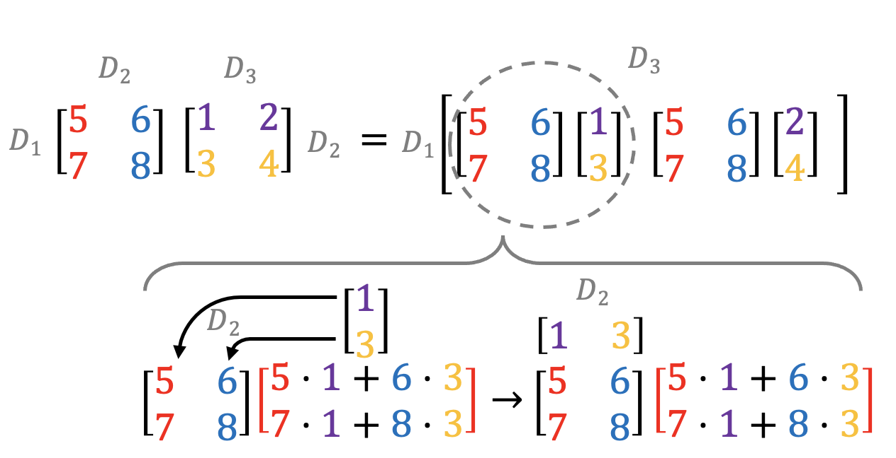

## Mat multiplication as linear transformation of coord system:
reference coord system:

$$
\begin{aligned}
{\color{blue}\boldsymbol{i}} &=
{\color{blue}
\begin{bmatrix}
1 \\
0
\end{bmatrix}},
&
{\color{red}\boldsymbol{j}} &=
{\color{red}
\begin{bmatrix}
0 \\
1
\end{bmatrix}}
\end{aligned}
$$

Take a vector $\boldsymbol{\vec{v}}$ with coordinates:

$$
\begin{bmatrix}
\color{purple}{x} \\
\color{orange}{y}
\end{bmatrix}
$$

For example:

$$
\boldsymbol{\vec{v}} = \begin{bmatrix}
\color{purple}{2} \\
\color{orange}{-1}
\end{bmatrix}
$$

It can be expressed as a linear combination of the coordinate system:

$$
\boldsymbol{\vec{v}}= \color{purple}{2}\color{blue}{\boldsymbol{i}} + \color{orange}{(-1)}\color{red}{\boldsymbol{j}} = \color{purple}{2} \color{blue}{\begin{bmatrix}
1 \\
0
\end{bmatrix}}\color{orange}{-1}\color{red}{\begin{bmatrix}
0 \\
1
\end{bmatrix}}=\color{black}\begin{bmatrix}
\color{purple}{2+0} \\
\color{orange}{0-1}
\end{bmatrix}=\begin{bmatrix}
\color{purple}{2} \\
\color{orange}{-1}
\end{bmatrix}
$$

For convenience, the reference coordinate system is usually indicate as a 2X2 matrix:

$$
\begin{bmatrix}
\color{blue}{1}&\color{red}{0} \\
\color{blue}{0}&\color{red}{1}
\end{bmatrix}
$$

In this case this is an identity matrix.

$$
\boldsymbol{\vec{v}}= \begin{bmatrix}
\color{blue}{1}&\color{red}{0} \\ 
\color{blue}{0}&\color{red}{1}
\end{bmatrix}\begin{bmatrix}
\color{purple}{2} \\
\color{orange}{-1}
\end{bmatrix}=\begin{bmatrix}
\color{purple}{2+0} \\
\color{orange}{0-1}
\end{bmatrix}=\begin{bmatrix}
\color{purple}{2} \\
\color{orange}{-1}
\end{bmatrix}
$$

This makes it very convenient in case of *linear* *transformations* (origin fixed, lines remain lines… if we add a fixed constant then that is referred to as an *affine* transformation) of the space. The linear transformation can be described by tracking the transformation of $\hat{i}$ and $\hat{j}$.
E.g.

$$
\begin{aligned}
\color{blue}{\boldsymbol{\hat{i}}} &=
\color{blue}{\begin{bmatrix}
2 \\
0
\end{bmatrix}},
&
\color{red}{\boldsymbol{\hat{j}}} &=
\color{red}{\begin{bmatrix}
1 \\
3
\end{bmatrix}}
\end{aligned}
$$

The linear transformation $L(\boldsymbol{\vec{v}})$ can be indicated as

$$
\begin{bmatrix}
\color{blue}{2}&\color{red}{1} \\
\color{blue}{0}&\color{red}{3}
\end{bmatrix}
$$

Consequently:

$$
\boldsymbol{\vec{v}}= \color{purple}{2}\color{blue}{\boldsymbol{\hat{i}}} + \color{orange}{(-1)}\color{red}{\boldsymbol{\hat{j}}} = \color{black}\begin{bmatrix}
\color{blue}{2}&\color{red}{1} \\
\color{blue}{0}&\color{red}{3}
\end{bmatrix}\begin{bmatrix}
\color{purple}{2} \\
\color{orange}{-1}
\end{bmatrix}=\begin{bmatrix}
\color{purple}{2}\cdot \color{blue}{2}+\color{orange}{-1}\cdot \color{red}{1} \\
\color{purple}{2}\cdot\color{blue}{0}\color{orange}{-1}\cdot\color{red}{3}
\end{bmatrix}=\begin{bmatrix}
\color{purple}{3} \\
\color{orange}{-3}
\end{bmatrix}
$$

Note: the convention is to read matrix multiplication from right to left; this is important because in matrix multiplication the order is crucial. In spatial transformations, changing the order of transformations changes the result. 

$$
g(f(\vec{v}))=\begin{bmatrix}
1&2 \\
3&4
\end{bmatrix}\begin{bmatrix}
5&6 \\
7&8
\end{bmatrix}\begin{bmatrix}
x \\
y
\end{bmatrix}
$$

Note that matrix multiplication has the associative property: $A(BC)=(AB)C$. 
you can think to matrix multiplication as composition of the two transformation so that $h(\vec{v})=g(f(\vec{v}))$

$$
h=\begin{bmatrix}
1&2 \\
3&4
\end{bmatrix}\begin{bmatrix}
5&6 \\
7&8
\end{bmatrix}=\begin{bmatrix}
\begin{bmatrix}
1&2 \\
3&4
\end{bmatrix}\begin{bmatrix}
5 \\
7
\end{bmatrix}&\begin{bmatrix}
1&2 \\
3&4
\end{bmatrix}\begin{bmatrix}
6 \\
8
\end{bmatrix}
\end{bmatrix}
$$

## Matrix multiplication
The product $\boldsymbol{C=AB}$ of two matrices $\boldsymbol{A} \in \mathbb{R}^{D_1\times D_2}$ and $\boldsymbol{B} \in \mathbb{R}^{D_2\times D_3}$, is a third matrix $\boldsymbol{C} \in \mathbb{R}^{D_1\times D_3}$

$$
\underbrace{\begin{bmatrix}
a_{11} & a_{12} \\
a_{21} & a_{22} \\
a_{31} & a_{32}
\end{bmatrix}}_{3 \times 2}
\;\times\;
\underbrace{\begin{bmatrix}
b_{11} & b_{12} & b_{13} \\
b_{21} & b_{22} & b_{23}
\end{bmatrix}}_{2 \times 3}
\;=\;
\underbrace{\begin{bmatrix}
a_{11}b_{11} + a_{12}b_{21} & a_{11}b_{12} + a_{12}b_{22} & a_{11}b_{13} + a_{12}b_{23} \\
a_{21}b_{11} + a_{22}b_{21} & a_{21}b_{12} + a_{22}b_{22} & a_{21}b_{13} + a_{22}b_{23} \\
a_{31}b_{11} + a_{32}b_{21} & a_{31}b_{12} + a_{32}b_{22} & a_{31}b_{13} + a_{32}b_{23}
\end{bmatrix}}_{3 \times 3}
$$
# Matrix multiplication as combination of linear equations

$$
\begin{aligned}
2\color{blue}{x}\color{black} + 5\color{red}{y}\color{black} + 3\color{green}{z}\color{black} &= -3\\
4\color{blue}{x}\color{black} + 0\color{red}{y}\color{black} + 8\color{green}{z}\color{black} &= 0\\
\color{blue}{x}\color{black}  + 3\color{red}{y}\color{black} + 0\color{green}{z}\color{black}
 &= 2
\end{aligned}
$$

$$
\overbrace{
\begin{bmatrix}
2 & 5 & 3 \\
4 & 0 & 8 \\
1 & 3 & 0
\end{bmatrix}
}^{A}
\quad
\overbrace{
\begin{bmatrix}
\color{blue}{x} \\
\color{red}{y} \\
\color{green}{z}
\end{bmatrix}
}^{\vec{x}}
\quad = \quad
\overbrace{
\begin{bmatrix}
-3 \\
0 \\
2
\end{bmatrix}
}^{\vec{v}}
$$

$A\vec{x}=\vec{v}$
## Inverse transformation
$A^{-1}\vec{v}=\vec{x}$
therefore the moltiplication the matrix and its inverse must be the identity matrix:

$$
AA^{-1}={\begin{bmatrix}
1 & 0 & 0 \\
0 & 1 & 0 \\
0 & 0 & 1
\end{bmatrix}}
$$

Se il determinante non è 0, esiste l’inverso della matrice e questo implica che c’è una sola soluzionte per l’equazione
In alcuni casi con determinante 0 potrebbe esserci un inverso
